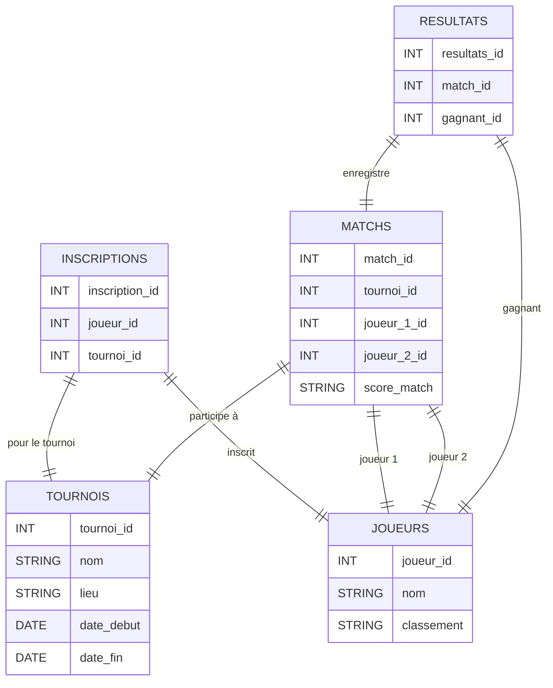

# Document de Conception - Tournoi de Tennis Multi chances

*Auteur : Aurélien BRESSON*

---

## Introduction

Le projet consiste à développer une base de données pour gérer un tournoi de tennis fictif. L'objectif est de suivre les matchs, d'enregistrer les résultats, et de calculer les statistiques des joueurs. Ce système est conçu pour permettre une gestion simplifiée d'un tournoi de tennis multi chances. Un tournoi multichances est un tournoi qui garanti aux joueurs de disputer plusieurs matchs même en cas de défaites puisque le nombre de matches que vous allez disputer ne dépend pas de vos résultats mais du nombre de participants. Les tournois multi chances opposent des joueurs ayant un niveau équivalent. 

---

## Objectif du Projet

Le but de ce projet est de créer une base de données fonctionnelle pour un tournoi de tennis multi chances. Cette base de données doit permettre de :

- Ajouter un tournoi avec ses informations (nom, lieu, dates).
- Ajouter des joueurs avec leurs classements.
- Créer des matchs entre les joueurs avec des scores réalistes.
- Enregistrer les résultats des matchs (gagnant/perdant).
- Calculer le vainqueur en fonction des victoires des joueurs.

---

## Portée du Projet

La portée de ce projet est limitée à la gestion d'un tournoi simple. Le tournoi comprend des joueurs inscrits, des matchs joués, et des résultats enregistrés. Ce projet ne prend pas en compte la gestion de plusieurs tournois ou des statistiques avancées sur les performances des joueurs.

---

## Entités et Relations

### Entités :

joueurs : Contient les informations sur chaque joueur, telles que le nom et le classement du joueur.

tournois : Contient les informations des tournois, telles que le nom, lieu, date_debut, et date_fin.

matchs : Contient les informations des matchs, incluant les joueur_1_id, joueur_2_id (références aux joueurs) et le score_match.

resultats : Contient les résultats des matchs, incluant le match_id et gagnant_id (références à un joueur qui a gagné).

inscriptions : Contient les informations sur les joueurs inscrits à des tournois, avec des références aux tables joueurs et tournois.

### Relations :
- **Un tournoi** peut avoir plusieurs **matchs**.  **Un tournoi** est lié à plusieurs **matchs**, chaque match ayant un identifiant unique (match_id).
- **Un match** implique deux **joueurs** (référencés par leurs `joueur_id`),  qui sont des références aux joueurs de la table joueurs.
- **Un match** a un **gagnant** enregistré dans la table **resultats** : La table resultats enregistre l'identifiant du gagnant (gagnant_id), qui est une référence à un joueur_id dans la table joueurs.
- **Un joueur** peut être inscrit à plusieurs **tournois** : La table inscriptions fait le lien entre un joueur et un tournoi, chaque inscription étant reliée à un tournoi spécifique et à un joueur spécifique via joueur_id et tournoi_id.

---

## Schéma de la Base de Données

## Conception et Structure des Tables

### 1. Table `joueurs`

La table `joueurs` contient des informations de base sur les joueurs, notamment leur nom et leur classement. Le `joueur_id` est une clé primaire auto-incrémentée pour identifier chaque joueur de manière unique.

#### Colonnes :
- **`joueur_id`** : Identifiant unique du joueur (clé primaire).
- **`nom`** : Nom du joueur.
- **`classement`** : Classement du joueur ( "30" ou "15/5").

### 2. Table `tournois`

La table `tournois` enregistre les informations concernant les tournois organisés, telles que le nom, le lieu, et la période.

#### Colonnes :
- **`tournoi_id`** : Identifiant unique du tournoi (clé primaire).
- **`nom`** : Nom du tournoi.
- **`lieu`** : Lieu où se déroule le tournoi.
- **`date_debut`** : Date de début du tournoi.
- **`date_fin`** : Date de fin du tournoi.

### 3. Table `matchs`

La table `matchs` contient les informations relatives aux matchs joués dans un tournoi. Elle fait référence aux joueurs participants au match et enregistre le score du match.

#### Colonnes :
- **`match_id`** : Identifiant unique du match (clé primaire).
- **`tournoi_id`** : Identifiant du tournoi (clé étrangère vers la table `tournois`).
- **`joueur_1_id`** et **`joueur_2_id`** : Identifiants des joueurs participant au match (clés étrangères vers la table `joueurs`).
- **`score_match`** : Le score du match, stocké sous forme de texte (par exemple, "6-4, 4-6, 6-0").

### 4. Table `resultats`

La table `resultats` enregistre le gagnant de chaque match. Elle fait référence à l'id du match et à l'id du gagnant.

#### Colonnes :
- **`resultats_id`** : Identifiant unique du résultat (clé primaire).
- **`match_id`** : Identifiant du match (clé étrangère vers la table `matchs`).
- **`gagnant_id`** : Identifiant du joueur gagnant (clé étrangère vers la table `joueurs`).

### 5. Table `inscriptions`

La table `inscriptions` lie les joueurs aux tournois auxquels ils sont inscrits. Un joueur peut participer à plusieurs tournois, et chaque inscription est associée à un tournoi spécifique.

#### Colonnes :
- **`inscription_id`** : Identifiant unique de l'inscription (clé primaire).
- **`joueur_id`** : Identifiant du joueur inscrit (clé étrangère vers la table `joueurs`).
- **`tournoi_id`** : Identifiant du tournoi auquel le joueur est inscrit (clé étrangère vers la table `tournois`).

## Optimisations et Limitations
### Optimisations :
1.Indexation :

Des index ont été créés sur les colonnes fréquemment utilisées dans les requêtes de jointure (par exemple, tournoi_id, joueur_1_id, et joueur_2_id dans la table matchs).

L'index sur la colonne gagnant_id dans la table resultats permet d'accélérer les requêtes de calcul des victoires.

2.Utilisation de AUTOINCREMENT : Cette fonctionnalité garantit que les joueur_id, tournoi_id, match_id, et resultats_id sont uniques sans intervention manuelle.

3.Relations entre les tables : L'utilisation de clés étrangères assure l'intégrité des données et garantit que chaque match est relié à un tournoi et deux joueurs.

### Limitations :
1. Système simplifié : Ce modèle ne gère qu'un seul tournoi à la fois. Il pourrait être étendu pour inclure plusieurs tournois, ainsi que des phases de qualifications et des rounds plus complexes.

2. Format des scores : Les scores sont stockés sous forme de texte. Pour des analyses plus complexes (comme le calcul de la moyenne des jeux gagnés), une structure différente pourrait être plus appropriée.

3. Absence de gestion des blessures ou des abandons : Le système ne prend pas en compte les joueurs blessés ou absents, ce qui pourrait affecter les résultats du tournoi.

### Conclusion 

Ce projet fournit une solution efficace pour gérer un tournoi de tennis multi-chances, avec des fonctionnalités de base comme la gestion des joueurs, des matchs et des résultats. Cependant, plusieurs améliorations sont possibles, telles que la gestion de plusieurs tournois simultanés, l'ajout d'analyses statistiques avancées, ou encore la gestion des abandons. Un suivi en temps réel des matchs et des optimisations sur les requêtes pourraient aussi enrichir le système, le rendant plus interactif et performant.
