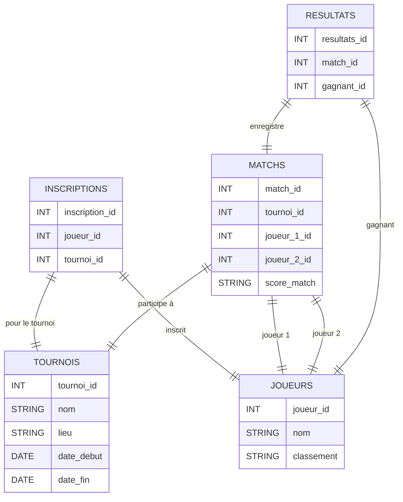

# Document de Conception - Tournoi de Tennis Multichance

*Auteur : Votre Nom*

---

## Introduction

Le projet consiste à développer une base de données pour gérer un tournoi de tennis fictif. L'objectif est de suivre les matchs, d'enregistrer les résultats, et de calculer les statistiques des joueurs. Ce système est conçu pour permettre une gestion simplifiée d'un tournoi de tennis en utilisant des règles classiques d'élimination directe, avec des matchs en 3 sets.

---

## Objectif du Projet

Le but de ce projet est de créer une base de données fonctionnelle pour un tournoi de tennis. Cette base de données doit permettre de :

- Ajouter un tournoi avec ses informations (nom, lieu, dates).
- Ajouter des joueurs avec leurs classements.
- Créer des matchs entre les joueurs avec des scores réalistes.
- Enregistrer les résultats des matchs (gagnant/perdant).
- Calculer le podium en fonction des victoires des joueurs.

---

## Portée du Projet

La portée de ce projet est limitée à la gestion d'un tournoi simple. Le tournoi comprend des joueurs inscrits, des matchs joués, et des résultats enregistrés. Ce projet ne prend pas en compte la gestion de plusieurs tournois ou des statistiques avancées sur les performances des joueurs.

---

## Entités et Relations

### Entités :
1. **joueurs** : Contient les informations de chaque joueur (nom, classement).
2. **tournois** : Contient les informations du tournoi (nom, lieu, dates de début et de fin).
3. **matchs** : Contient les informations des matchs, tels que les joueurs participants et les scores.
4. **resultats** : Contient les résultats des matchs, avec le joueur gagnant.

### Relations :
- **Un tournoi** peut avoir plusieurs **matchs**.
- **Un match** implique deux **joueurs** (référencés par leurs `joueur_id`).
- **Un match** a un **gagnant** enregistré dans la table **resultats**.

---

## Schéma de la Base de Données

## Conception et Structure des Tables

### 1. Table joueurs

La table joueurs contient des informations de base sur les joueurs, notamment leur nom et leur classement. Le joueur_id est une clé primaire auto-incrémentée pour identifier chaque joueur de manière unique.

colonnes :

joueur_id : Identifiant unique du joueur (clé primaire).

nom : Nom du joueur.

classement : Classement du joueur, par exemple, "30", "15/5", ou "0".

### 2.Table tournois

La table tournois enregistre les informations concernant les tournois organisés, comme le nom, le lieu, et la période.

colonnes :

tournoi_id : Identifiant unique du tournoi (clé primaire).

nom : Nom du tournoi.

lieu : Lieu où se déroule le tournoi.

date_debut et date_fin : Les dates de début et de fin du tournoi.

### 3.Table matchs

La table matchs contient les informations relatives aux matchs joués dans le tournoi. Elle fait référence aux joueurs participant au match et enregistre le score du match.

colonnes :

match_id : Identifiant unique du match (clé primaire).

tournoi_id : Identifiant du tournoi (clé étrangère vers la table tournois).

joueur_1_id et joueur_2_id : Identifiants des joueurs participant au match (clé étrangère vers la table joueurs).

score_match : Le score du match, stocké sous forme de texte (par exemple, "6-4, 4-6, 6-0").

### 4. Table resultats

La table resultats enregistre le gagnant de chaque match, en référence à l'id du match et de celui du gagnant.

colonnes :

resultats_id : Identifiant unique du résultat (clé primaire).

match_id : Identifiant du match (clé étrangère vers la table matchs).

gagnant_id : Identifiant du joueur gagnant (clé étrangère vers la table joueurs).

### 5. Table inscriptions : 

La table lie les joueurs aux tournois auxquels ils sont inscrits.

## Optimisations et Limitations
### Optimisations :
1.Indexation :

Des index ont été créés sur les colonnes fréquemment utilisées dans les requêtes de jointure (par exemple, tournoi_id, joueur_1_id, et joueur_2_id dans la table matchs).

L'index sur la colonne gagnant_id dans la table resultats permet d'accélérer les requêtes de calcul des victoires.

2.Utilisation de AUTOINCREMENT : Cette fonctionnalité garantit que les joueur_id, tournoi_id, match_id, et resultats_id sont uniques sans intervention manuelle.

3.Relations entre les tables : L'utilisation de clés étrangères assure l'intégrité des données et garantit que chaque match est relié à un tournoi et deux joueurs.

### Limitations :
1. Système simplifié : Ce modèle ne gère qu'un seul tournoi à la fois. Il pourrait être étendu pour inclure plusieurs tournois, ainsi que des phases de qualifications et des rounds plus complexes.

2. Format des scores : Les scores sont stockés sous forme de texte. Pour des analyses plus complexes (comme le calcul de la moyenne des jeux gagnés), une structure différente pourrait être plus appropriée.

3. Absence de gestion des blessures ou des abandons : Le système ne prend pas en compte les joueurs blessés ou absents, ce qui pourrait affecter les résultats du tournoi.

### Conclusion 

Ce projet présente une solution simple pour gérer un tournoi de tennis avec des joueurs, des matchs et des résultats. Il démontre l'utilisation de SQL pour créer une base de données relationnelle, gérer des entités interconnectées et effectuer des requêtes sur les données. Les optimisations, telles que l'indexation des colonnes fréquemment utilisées et l'usage de clés primaires et étrangères, permettent d'assurer une manipulation rapide et fiable des données.
